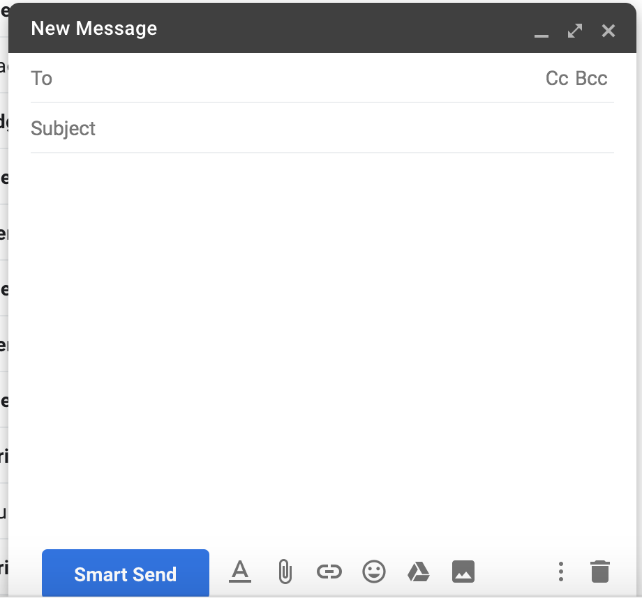

A tentative project of browser extension that alert user before sending emails in gmail. The key at the beginning phase is to ensure cross-browser compatibility with a low level of effort for maintenance. Also serves as a project template.

### App snapshots
* Replace the send button with custom button.
* Show options (send now or schedule send) onClick.
* Utilize the original schedule component of Gmail.

### Project Structure

#### `/manifests`
For individual manifest.json file and icons used in manifest specific to browsers.

#### `/react`
For coding the frontend apps. create seperate apps (`create-react-app`) for different pages, for example popup, content, newTab etc.

To compile the build output to be compatible manifest, eject and update the default create-react-app config to output specific html filename that matches the manifest.

For all react apps:
** update `resolveApp` in `paths.js` so webpack finds and builds to correct folder.
** update `appNodeModules` in `config/paths.js` to point to correct folder.

For **popup** page: 
** Update `webpack.config.js` by adding `filename` to `HtmlWebpackPlugin`.

For **content** script:
Because we only need content.js, update webpack config to output content.js without hash. I followed [this blog](https://itnext.io/create-chrome-extension-with-reactjs-using-inject-page-strategy-137650de1f39#3996) for the most part, but due to different folder structure and the change in the webpack config files for `create-react-app` since the time of the article, need to 
** update `ManifestPlugin`.
** add `contentJs` to the export of `config/paths.js` and use it in webpack config.
** **remove `splitChunks` and set `runtimeChunk` to false so that the react code is executable**, see [this post](https://stackoverflow.com/questions/57270855/chrome-extension-content-script-not-injecting-to-the-dom-when-built-with-reactjs).

#### `/src`
For background.js.

### Build and pacakge
Run `./build.sh <browser name>`, will create a `publish` folder with necessary files copied inside. Package as needed for publish.

For development, [run chrome extension in developer mode](https://developer.chrome.com/extensions/getstarted).

### Challenges, notes and libraries used:
#### Bugs, improvements, and maintenance
* Buttons are not aligned on window scroll for inline reply and after switching to popup compose view. The first may be resolved by adding event listener; the second need to find a hook for changing compose view.
* Handle the case when composing multiple drafts -- to identify the currently active compose window.
* The compose element is identified via page HTML structure and classes, thus requires regular tests to make sure it does not break due to Gmail updates.

#### Others
* To bypass the restriction of CSP, create a `.env` file in root directory and put `INLINE_RUNTIME_CHUNK=false` inside it (if use `create-react-app` to build). Ref: [https://github.com/facebook/create-react-app/issues/5897](https://github.com/facebook/create-react-app/issues/5897)
* to use Chrome API inside React files, add `/*global chrome*/` in the top of the file. Ref: [using chrome api with react js](https://stackoverflow.com/questions/51411447/using-chrome-api-with-react-js)
* [Chrome Extension Async](https://github.com/KeithHenry/chromeExtensionAsync)

* This project use [Gmail.js](https://github.com/KartikTalwar/gmail.js) for interface with gmail. However the support for new Gmail is limited for some methods ([`send_message` events not working](https://github.com/KartikTalwar/gmail.js/issues/601)). Should keep an eye on it.
